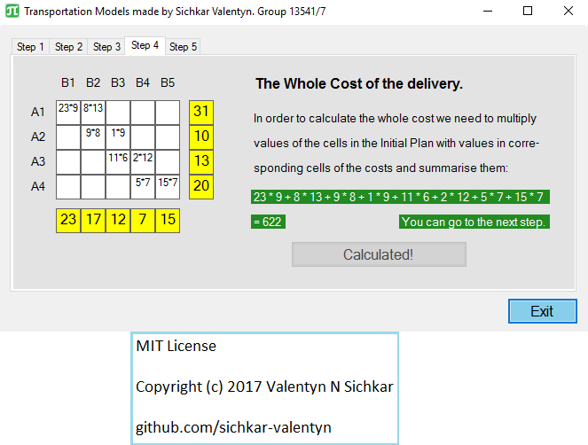
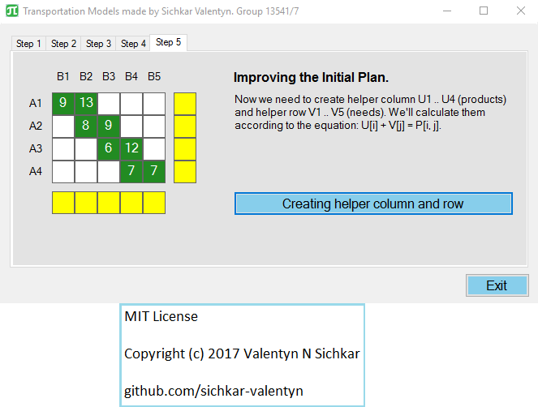

# Transportation Problem
Transportation Model for an optimal strategy for distributing a commodity from a group of supply centers to various receiving centers. Solved in C# Windows Form Application.

### Reference to:
[1] Valentyn N Sichkar. Transportation Model for an optimal strategy for distributing a commodity from a group of supply centers to various receiving centers. Solved in C# Windows Form // GitHub platform [Electronic resource]. URL: https://github.com/sichkar-valentyn/Transportation_Problem (date of access: XX.XX.XXXX)

## Description
The general transportation problem is concerned with determining an optimal strategy for distributing a commodity from a group of supply centers, such as factories, called sources, to various receiving centers, such as warehouses, called destinations, in such a way as to minimize total distribution costs.

Each source is able to supply a fixed number of units of the product, usually called the capacity or availability, and each destination has a fixed demand, often called the requirement.

Transportation models can also be used when a firm is trying to decide where to locate a new facility. Good financial decisions concerning facility location also attempt to minimize total transportation and production costs for the entire system.

## Task
There are 4 warehouse containing some number of units of the same type of product (see table 1), there is also 5 consumers depend on a certain amount of these products (see table 2). When shipping one unit from warehouse i to consumer j costs Pij arise. The magnitude of the costs is shown in table 3.

For the transportation K units from warehouse i to consumer j the total transportation cost is K*Pij.

The task is to find a transportation plan in which the total transportation cost of all products to all consumers will be minimal.

## Task for Transportation Problem

## Checking for the balance

## Finding the Initial Plan

## Finding the Initial Plan - Iteration 2

## Finding the Initial Plan - Iteration 3

## Finding the Initial Plan - Iteration 4

## Finding the Initial Plan - Iteration 5

## Finding the Initial Plan - Iteration 6

## Finding the Initial Plan - Iteration 7

## Finding the Initial Plan - Iteration 8

## Finding the Initial Plan - Found.png

## Checking for the Non Empty Condition

## The Whole Cost of the delivery

## Improving the Initial Plan

## Improving the Initial Plan Creating helper column and row

## Improving the Initial Plan Calculating evaluations for the rest empty cells

## Improving the Initial Plan Finding the largest value among the negative

## Improving the Initial Plan Building circle

## Improving the Initial Plan Finding minimum

## Building new Initial Plan

## To Find the Optimal Final Plan

## Optimal Final Plan-Found

## Results and Conclusions

## MIT License
## Copyright (c) 2017 Valentyn N Sichkar
## github.com/sichkar-valentyn
### Reference to:
[1] Valentyn N Sichkar. Transportation Model for an optimal strategy for distributing a commodity from a group of supply centers to various receiving centers. Solved in C# Windows Form // GitHub platform [Electronic resource]. URL: https://github.com/sichkar-valentyn/Transportation_Problem (date of access: XX.XX.XXXX) 
